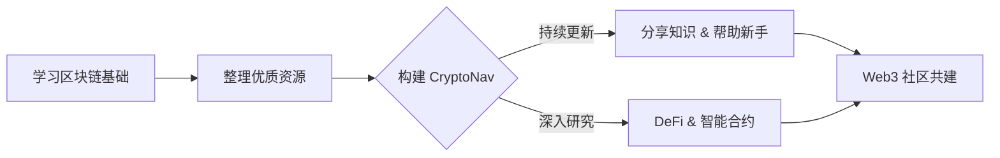

# 👋 你好，我是 okxgate

**加密货币爱好者 | Web3探索者 | 技术分享者**

---

## 📝 关于我

👋 **Hi，我是 okxgate！**

我是一名坚定的 **Web3 信仰者** 和 **开源贡献者**。在区块链的浪潮中，我致力于成为一名“**摆渡人**” —— 通过整理最优质的资源、分享最实用的工具，帮助更多人跨越认知的鸿沟，安全、轻松地探索加密世界。

🌟 **我的核心理念**
- **DeFi for Everyone**：金融自由不应有门槛，每个人都应掌握自己的资产。
- **Keep Building**：无论牛熊，持续构建和学习才是穿越周期的唯一法则。
- **Open Source**：开源精神是区块链的基石，我乐于分享所学，与社区共同成长。

👇 **我的专注领域**
- � **资源整合**：维护全网最全的 [CryptoNav 导航站](https://github.com/okxgate/crypto_nav)，打造币圈新手的“瑞士军刀”。
- 🌱 **技术探索**：深入研究 **智能合约安全**、**DeFi 经济模型** 以及 **Layer2 扩容方案**。
- 🤝 **社区共建**：积极参与 DAO 治理，翻译优质英文研报，消除中文社区的信息差。

---

## 🚀 精选项目

### [🔥 CryptoNav - 全网最全加密货币导航站](https://github.com/okxgate/crypto_nav)

> **一站式加密货币资源导航平台，新手入门必备！**

| 核心功能 | 描述 |
| :--- | :--- |
| 📊 **全面覆盖** | 涵盖中心化交易所 (CEX)、去中心化交易所 (DEX)、Web3 钱包 |
| 🎯 **精准导航** | 整合空投平台、投研工具、链上数据分析 |
| 🛡️ **安全第一** | 提供钱包安全指南、防诈骗教程、审计资源 |
| 📚 **知识库** | 收录优质学习资源、开发工具、项目白皮书 |

---

## 🛠️ 技术栈与工具

| 领域 | 技术/工具 |
| :--- | :--- |
| **💻 前端开发** | HTML5, CSS3, JavaScript, Markdown |
| **⛓️ 区块链** | Ethereum, Bitcoin, Web3.js, Solidity (Learning) |
| **� 开发工具** | Git, VS Code, Remix IDE |
| **� 部署运维** | GitHub Pages, Vercel |

---

## 🎯 探索路线图

---

## 📫 联系与交流

如果你对我的项目感兴趣，或者想交流区块链技术，欢迎通过以下方式联系我：

- 🏠 **GitHub 主页**: [github.com/okxgate](https://github.com/okxgate)
- 📧 **Email**: [your-email@example.com](mailto:your-email@example.com)
- 💬 **留言板**: [点击这里给我留言](https://github.com/okxgate/okxgate/issues)

---

**⭐ 如果我的项目对你有帮助，请给个 Star 支持一下！**

*最后更新：2026年2月6日

