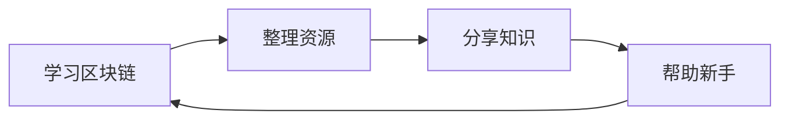

# 👋 你好，我是 okxgate

  

---

## 📝 关于我

我是一个热衷于加密货币和区块链技术的开发者，致力于为新手提供最全面的币圈资源导航。我相信知识共享的力量，希望通过整理和分享，帮助更多人轻松入门Web3世界。

- 🔭 目前专注于：加密货币资源整合、Web3工具推荐
- 🌱 正在学习：DeFi协议、智能合约开发
- 💼 主要项目：[CryptoNav - 全网最全加密货币导航站](https://github.com/okxgate/crypto_nav)
- 🤝 希望合作：与志同道合的开发者交流学习

---

## 🚀 我的项目

### 🔥 CryptoNav - 全网最全加密货币导航站

> 一站式加密货币资源导航平台，新手入门必备！

  

**项目特色：**
- 📊 涵盖中心化交易所、去中心化交易所、Web3钱包
- 🎯 整合空投平台、投研工具、数据分析
- 🛡️ 提供安全指南、防诈骗教程
- 📚 收录学习资源、开发工具、白皮书

---

## 🛠️ 技术栈

### 前端开发

### 区块链

### 工具

---

## 📊 GitHub 统计

  

  

  

---

## 📈 贡献活动

  

---

## 🎯 我在做什么

---

## 📫 联系方式

如果你对我的项目感兴趣，或者想交流区块链技术，欢迎联系我！

---

## 💬 访客留言

欢迎在这里留言，告诉我你的想法！

**[📝 留言板](https://github.com/okxgate/okxgate/issues)**

---

**⭐ 如果我的项目对你有帮助，请给个Star支持一下！**

---

*最后更新：2026年1月*

